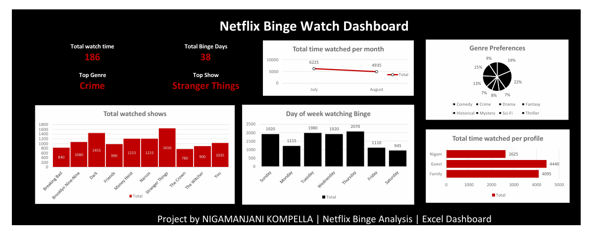

# Netflix Binge Watch Dashboard (Excel Project)

This is a visually engaging and insight-driven Excel dashboard built to analyze binge-watching patterns from Netflix usage data. Designed with a Netflix-inspired theme, the dashboard showcases key metrics, viewing habits, and genre preferences in a clean, professional layout.

---

## Key Features

-  **Total Watch Time** and **Binge Days** summary
-  Highlights the **Top Genre** and **Top Show**
-  Viewing trend by **Month** and **Day of Week**
-  Profile-based analysis: **Family**, **Guest**, **Nigam**
-  Top watched shows and **genre distribution**
-  Netflix-style theme (black, red, white)
- ⚙ Built using **PivotTables** and **PivotCharts** in Excel (Web version)

---

## 🖼 Dashboard Preview

  

---

## Project Contents

| File | Description |
|------|-------------|
| `Netflix_Dataset.xlsx` | Main Excel dashboard file |
| `Netflix_Dashboard.pdf` | PDF snapshot of the dashboard |
| `Netflix_dashboard.png` | Image preview  |
| `README.md` | Project documentation |

---

##  Tools Used

- Microsoft Excel (Web Version)
- PivotTables
- PivotCharts
- Custom formatting, color themes, layout design

---

## Insights Highlighted

- Users watched the most during **Thursdays**.
- **Crime** was the most binge-worthy genre.
- **Stranger Things** was the top-watched show.
- The **Guest** profile spent the most time watching.

---

## Learning Goals

This project was created to:
- Practice data visualization with Excel
- Learn layout and storytelling with dashboards
- Explore real-world behavioral analysis using structured data

---

## About the Creator

Created by Nigamanjani Kompella  
Connect on [LinkedIn](linkedin.com/in/nigamanjani-kompella-918591215/)  

---

## License

This project is open for learning and educational use. Attribution appreciated.

